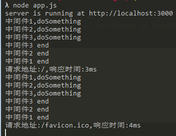
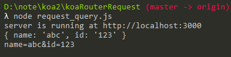
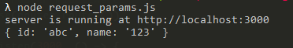

#  Koa2学习

## 环境部署

### 初始化目录

进入目录结构中,然后利用:

```bash
yarn init
```

初始化项目,这样之后会生成一个`package.json`文件

然后新增一个`app.js`文件 作为**入口文件**


### 启动服务器

先安装koa

```
yarn add koa
```


在`app.js`中项目中引入koa,并且生成实例

```js
const Koa = require('koa');
const app = new Koa();

app.listen(3000, () => {
  console.log('server is running at http://localhost:300')
})
```

然后运行`node app.js`

这样打开服务了


## 中间件

[api](https://koajs.com/)

### 中间件next的执行顺序

```javascript
const Koa = require('koa');
const app = new Koa();

// 记录执行时间
app.use(async (ctx, next) => {
  let stime = new Date().getTime();
  await next()
  let etime = new Date().getTime();
  ctx.response.type = 'text/html';
  ctx.response.body = `<h1>Hello World!</h1>`;
  console.log(`请求地址:${ctx.path},响应时间:${etime - stime}ms`)
})

app.use(async (ctx, next) => {
  console.log('中间件1,doSomething');
  await next()
  console.log('中间件1 end');
})

app.use(async (ctx, next) => {
  console.log('中间件2,doSomething');
  await next()
  console.log('中间件2 end');
})

app.use(async (ctx, next) => {
  console.log('中间件3,doSomething');
  await next()
  console.log('中间件3 end');
})

app.listen(3000, () => {
  console.log('server is running at http://localhost:3000')
})
```



中间件流转顺序类似于dom事件的流程,先捕获后冒泡,从外往里再从里往外,

也叫**洋葱模式**,Request类似捕获,Response类似冒泡


## [路由 Koa-Router](./koaRouter)

不使用koa-Router

```js
const Koa = require('koa');
const app = new Koa();

// 记录执行时间
app.use(async (ctx, next) => {
  if (ctx.request.path === '/') {
    ctx.response.body = `<h1>index page</h1>`
  } else {
    await next();
  }
})

app.use(async (ctx, next) => {
  if (ctx.request.path === '/home') {
    ctx.response.body = `<h1>home page</h1>`
  } else {
    await next();
  }
})
app.use(async (ctx, next) => {
  if (ctx.request.path === '/404') {
    ctx.response.body = `<h1>404 not found</h1>`
  } else {
    await next();
  }
})


app.listen(3000, () => {
  console.log('server is running at http://localhost:3000')
})
```


### 使用koaRouter

安装:

```bash
yarn add koa-router
```

(api)[https://www.npmjs.com/package/koa-router]

效果代码:

```bash
node app_koa_router.js
```

```js
const Koa = require('koa');
// const Router = require('koa-router');
// const router = new Router();
// 因为require('koa-router')返回的是函数,所以有以下简写
const router = require('koa-router')();
const app = new Koa();
// 添加路由
router.get('/', async (ctx, next) => {
  ctx.response.body = `<h1>index page</h1>`;
})

router.get('/home', async (ctx, next) => {
  ctx.response.body = `<h1>home page</h1>`;
})

router.get('/404', async (ctx, next) => {
  ctx.response.body = `<h1>404 not found</h1>`;
})


// 匹配上面没有的地址
router.all('/*', async (ctx, next) => {
  ctx.response.status = 404;
  ctx.response.body = '<h1>404 not found</h1>'
})

// 调用中间件
app.use(router.routes());

app.listen(3000, () => {
  console.log('server is running at http://localhost:3000')
})
```

当然，除了 `GET` 方法，`koa-router` 也支持处理其他的请求方法，比如：

```js
router
  .get('/', async (ctx, next) => {
    ctx.body = 'Hello World!';
  })
  .post('/users', async (ctx, next) => {
    // ... 
  })
  .put('/users/:id', async (ctx, next) => {
    // ... 
  })
  .del('/users/:id', async (ctx, next) => {
    // ... 
  })
  .all('/users/:id', async (ctx, next) => {
    // ... 
  });
```

在`HTTP`协议方法中,`GET`,`POST`,`PUT`,`DELETE`分别对应`查`,`增`,`改`,`删`,在`router`也一一对应,在`router`里面还有一个`all`,用于上面所有路由没有适配的情况下(一般用于出404吧);


### 命名路由

```js
const Koa = require('koa');
const router = require('koa-router')();
const app = new Koa();
router.get('user', '/user/:id', async (ctx, next) => {
  ctx.response.body = '<h1></h1>'
})

const userUrl = router.url('user', 3);
console.log('userUrl', userUrl);
// =>生成路由 /user/3

const userUrl2 = router.url('user', { id: 4 });
console.log('userUrl2', userUrl2);
// =>生成路由 /user/4

// 调用中间件
app.use(router.routes());

app.listen(3000, () => {
  console.log('server is running at http://localhost:3000')
})
```

`router.url` 方法方便我们在代码中根据路由名称和参数(可选)去生成具体的 `URL`，而不用采用字符串拼接的方式去生成 `URL`了。


### 多中间件

`koa-router`支持单个路由多中间件处理,当路由处理函数中有异步操作的时候,这种写法的可读性和可维护性更高.

```js
router.get(
  '/users/:id',
  function (ctx, next) {
    return User.findOne(ctx.params.id).then(function(user) {
      // 首先读取用户的信息，异步操作
      ctx.user = user;
      //调用next调用下个中间件
      await next();
    });
  },
  function (ctx) {
    console.log(ctx.user);
    // 在这个中间件中再对用户信息做一些处理
    // => { id: 17, name: "Alex" }
  }
);
```

利用`await next()`调用下个中间件


 ### 嵌套路由

在应用中定义多个路由，然后把这些路由组合起来用，这样便于我们管理多个路由，也简化了路由的写法。

```js
const Koa = require('koa');
const forums = require('koa-router')();
const posts = require('koa-router')();
const app = new Koa();

// 第一个路由
posts.get('/', async (ctx, next) => {
  ctx.response.body = `<h1>responds to ${ctx.path}
  </br>
  可以获到外面的fid:${ctx.params.fid}</h1>`
})
posts.get('/:pid', async (ctx, next) => {
  ctx.response.body = `<h1>responds pid to ${ctx.path}
  </br>
  可以获到外面的fid:${ctx.params.fid}和pid:${ctx.params.pid}
  </h1>`
})

/* 第二个路由
*  第二个参数:将第一个路由作为中间件传入,
*  第三个参数:将第一个路由异常处理方法传入,
*/

/* 这个地址作为根地址,
 * 当访问/forums/123/posts时,就是访问posts的'/';
 * 访问/forums/123/posts/123的时候,就是访问posts的'/:pid'
*/
forums.use('/forums/:fid/posts', posts.routes(), posts.allowedMethods());

// responds to '/forums/123/posts'
// responds to '/forums/123/posts/123'
app.use(forums.routes());

app.listen(3000, () => {
  console.log('server is running at http://localhost:3000')
})
```


### 路由前缀

通过 `prefix` 这个参数，我们可以为一组路由添加统一的前缀，和嵌套路由类似，也方便我们管理路由和简化路由的写法。不同的是，前缀是一个固定的字符串，不能添加动态参数。

```js
var router = new Router({
  prefix: '/users'
});
 
router.get('/', ...); // 匹配路由 "/users" 
router.get('/:id', ...); // 匹配路由 "/users/:id" 
```


### URL参数

`koa-router` 也支持参数，参数会被添加到 `ctx.params` 中。参数可以是一个正则表达式，这个功能的实现是通过 `path-to-regexp` 来实现的。原理是把 `URL` 字符串转化成正则对象，然后再进行正则匹配，之前的例子中的 `*` 通配符就是一种正则表达式。

```js
router.get('/:category/:title', function (ctx, next) {
  console.log(ctx.params);
  // => { category: 'programming', title: 'how-to-node' } 
});
```

通过上面的例子可以看出，我们可以通过 `ctx.params` 去访问路由中的参数，使得我们能够对参数做一些处理后再执行后续的代码。


## POST/GET请求

### 请求参数放在`URL`后面(query)

其实就是普通的`/?name=abc&id=123`

```js
const Koa = require('koa');
const router = require('koa-router')();
const app = new Koa();

router.get('/', async (ctx, next) => {
  ctx.response.body = `<h1>index page</h1>`
})

router.get('/home', async (ctx, next) => {
  let query = ctx.request.query;
  let queryString = ctx.request.querystring;
  // 对象
  console.log(query);
  // 字符串
  console.log(queryString);
  ctx.response.body = `<h1>HOME page</h1>`
})
// add router middleware:
app.use(router.routes())

app.listen(3000, () => {
  console.log('server is running at http://localhost:3000')
})
```

访问地址`http://localhost:3000/home?name=abc&id=123`




### 请求参数放在`URL`中间(params)

利用`ctx.params`获取参数对象

```js
const Koa = require('koa');
const router = require('koa-router')();
const app = new Koa();

router.get('/', async (ctx, next) => {
  ctx.response.body = `<h1>index page</h1>`
})

router.get('/home/:id/:name', async (ctx, next) => {
  console.log(ctx.params);
  ctx.response.body = `<h1>id为:${ctx.params.id} name为:${ctx.params.name}</h1>`
})
// add router middleware:
app.use(router.routes())

app.listen(3000, () => {
  console.log('server is running at http://localhost:3000')
})
```

访问地址`http://localhost:3000/home/abc/123`




### 请求参数放在 `body` 中

当用 `post` 方式请求时，我们会遇到一个问题：`post` 请求通常都会通过表单或 `JSON` 形式发送，而无论是 `Node` 还是 `Koa`，都 **没有提供** 解析 `post` 请求参数的功能。

### koa-bodyparser 说：『是时候登场了！』

安装:

```bash
yarn add koa-bodyparser
```

```js
const Koa = require('koa')
const router = require('koa-router')()
const bodyParser = require('koa-bodyparser')
const app = new Koa()

app.use(bodyParser())

// 注册表单
router.get('/user', async (ctx, next) => {
  ctx.response.body =
    `
  <form action="/user/register" method="post">
    <input name="name" type="text" placeholder="请输入用户名:abc">
    <br/>
    <input name="password" type="text" placeholder="请输入密码:123"/>
    <br/>
    <button>GOGOGOGO!</button>
  </form>
  `
})


// 增加响应表单请求的路由
router.post('/user/register', async (ctx, next) => {
  // 用了bodyParser之后,就能从ctx.request.body中获取参数了
  console.log(ctx.request.body);
  let { name, password } = ctx.request.body;
  if (name === 'abc' && password == '123') {
    ctx.response.body = `hello,${name}`;
  } else {
    ctx.response.body = '账户信息错误'
  }
})

app.use(router.routes())

app.listen(3000, () => {
  console.log('server is running at http://localhost:3000')
})
```

> 用了bodyParser之后,就能从ctx.request.body中获取参数了