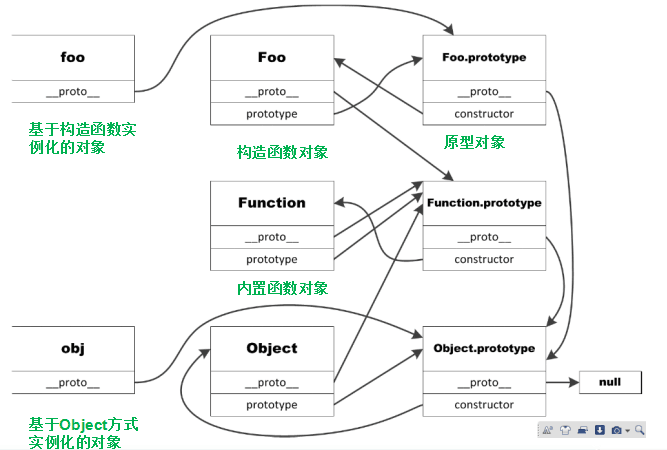

# 原型链进阶

### 自定义对象 内置对象 Object Function对象

- 他们之间的关系到底是什么呢?

#### 1. 原型链复习

- 原型链就是将两个没什么关系的内存空间相链
- 依靠的就是\_\_proto\_\_属性

#### 2. new的本质

- 创建一个空对象
- 拷贝构造函数的属性方法到空对象中
- 自动生成一个属性\_\_proto\_\_指向类的原型

#### 3. Object对象的\_\_proto\_\_

##### == 是值相等就可以了,会自动进行类型转换  ===是全等,数据类型和数值一样,那么才相等

- Object对象是内置对象Function对象实例
	+ Object.\_\_proto\_\_ === Function.prototype //true
	+ Function.prototype.\_\_proto\_\_ === Object.prototype //true
	+ Object.prototype.\_\_proto\_\_ 指向为null

- 以后将Object和Function看成四个对象
	+ Object
	+ Object.prototype
	+ Function
	+ Function.prototype

- 内置对象\_\_proto\_\_指向的全是===Function.prototype

- 自定义对象\_\_proto\_\_原型指向内置对象.prototype
- 内置对象.prototype原型指向Function.prototype
- Function.prototype原型指向Object.prototype
- Object.prototype原型指向为null

- 只要原型指向不是为null,就会一层一层往下找

#### 4. 内置对象属性搜索机制--链式搜索法则

- 搜索机制
	+ 首先在构造对象中寻找属性(方法)
	+ 如过没找到,找到该对象的proto指向的对象,继续寻找属性(方法)
	+ 如此无限循环,直到proto指向为null

- 停止条件
	+ 系统已经设计好,Object.prototype对象的proto为null,是所有链式属性搜索的终点

#### 5. 构造函数的原型链

- 例子:Foo
	+ Foo.\_\_proto\_\_ 指向的是Function.prototype===>Object.prototype
	+ Foo.prototype.\_\_proto\_\_指向的是Object.prototype

## 鼻祖是Object.prototype ,是一切链式循环的终点

### 图

## 总结

- JS里面面向对象是通过原型链实现的 

### 面试题

- 什么是面对对象
	+ 面向对象就是提炼属性和方法,将属性放在构造函数当中,将方法放在原型当中,有三大作用,封装性,描述数据,面向对象编程
	+ js语言实现对象和后台语言不太一样----原型链---属性搜索机制
	+ 三大特性:继承 封装 多态

- Call 和apply的区别
	+ 供爷法则
	+ Call传参数据是平铺的 
	+ Apply传参只能放一个数据,所以多个数据要用数组形式
	+ student借用myclass.getAllStudentsNumbers;就要像爷一样,把借用的对象放在前面
	+ 方法:myclass.getAllStudentsNumbers.call(student)

- JSON协议和JSON对象关系
	+ 没关系 一个是国际标准规定书写方式 是一种协议,标准
	+ JSON对象是对象的字面量