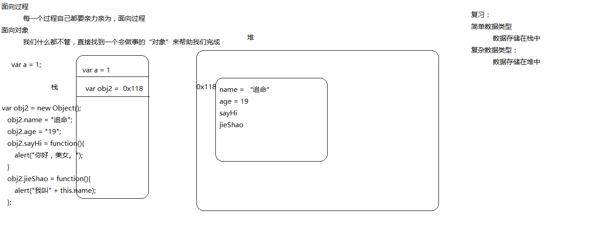

# 面对对象笔记


> 简单数据类型存储在栈中

> 复杂数据类型存储在堆中

> 不适用原型创建对象时方法会占空间,使用原型就会存储在内存中,对象只需要存储地址

> 原型本质上来说也是一个对象,所以也可以动态添加属性

> 通过构造函数创建的对象，这些对象同构造函数共同拥有原型(prototype)

> 在调用原型的属性方法的时候,会现在对象里面找,如果有就输出,没有则在原型里找,都没有则报错;

```javascirpt
	function person(option){
		this._init(option);
	}
	// 初始化 交给原型
	person.prototype={
		// 加下划线 代表只希望内部使用
		_init:function(option){
			this.name=option.name;
			this.age=option.age;
		},
		jieshao:function(){
            alert("我是"+this.name);
        },
    
        sayhi:function(){
            alert("hi");
        }
	}
	var abc = {
        "name": "邓皓文",
        "age": "22",
        "sex": "male"
    };
    var me = new person(abc);
    alert(me.name);
    alert(me.age);
    me.jieshao();
    me.sayhi();

```


### new 
> 第一步 创建了新的对象
> 第二步 把this指向新的对象
> 第三步 把新对象的内部原型(_proto_)指向构造函数的原型对象(prototype)
> 第四步 当构造函数执行完成后,如果没有return就把当前新对象返回

### this
> this第一种模式:函数执行模式
```javascript
	//this第一种模式:函数执行模式
	function add(){
		this.x=1;
		y=1;
		//如果在函数中定义一个变量,并且没有加var修饰,那么这个变量相当于全局变量,相当于在window下面定义的
		// this指向window
		alert(this.x);
	}

	add();
	alert(x);
	//变形
	var x =1;
	function add(){
		alert(this.x);
	}
	add();
```

> this第二种模式:对象方法的调用模式
```javascript
	//this 第二种模式:对象方法的调用模式
	function show(){
		alert(this.x);
	};
	var o ={};
	o.x=2;
	o.m=show;
	o.m();
```

> this第三种模式:构造器模式
```javascript 
	//this 第三种模式:构造器模式
	function Cat(){
		this.x=1;
	}
	var c = new Cat();
	alert(c.x);//构造器调用模式:this指向构造出来的对象
```


>this 第四种模式:使用其他方法来改变this模式:(apply,call)


******************
### 笔记图解

> 对象存储在内存中的结构



> 不使用原型创建对象时方式会占空间


> 原型的注意点


>构造函数改造过程图解


>对象原型和构造函数原型

