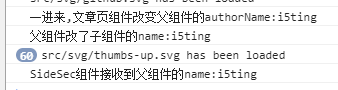

# VueDemo

一个Vue练习..

#### event bus
这里项目并不需要vuex,可以通过event bus来进行组件之间的传参
[event bus笔记](../eventBus.html)

##### 记录一下`处理文掉文章页两次相同xhr的问题和一个问题`

路由切换的时候`ArticleCom`获取到`${this.$route.path}` 参数,并进行请求,然后将值赋给父组件`this.$parent.authorName`,父组件进行`ref`赋值

```js
watch: {
  authorName(val) {
    this.$refs.child.name = val;
  }
}
```


再将`authorName`作为`name` 传给`SideSec`(拿个容器来装,并且watch它,发生改变时则请求),然后就可以请求,然后就可以获取到信息了

> 子==>父==>子




原作者:[ShuiRong Lin](https://github.com/shuiRong/)
github:https://github.com/shuiRong/VueCnodeJS