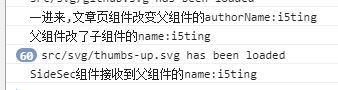

# VueDemo

作者:[ShuiRong Lin](https://github.com/shuiRong/)

github:https://github.com/shuiRong/VueCnodeJS

##### 记录一下`处理文掉文章页两次相同xhr的问题和一个问题`

路由切换的时候`ArticleCom`获取到`${this.$route.path}` 参数,并进行请求,然后将值赋给父组件`this.$parent.authorName`,父组件进行`ref`赋值,再将`authorName`作为`name` 传给`SideSec`,然后就可以请求,然后就可以获取到信息了

