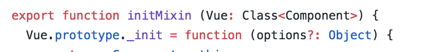
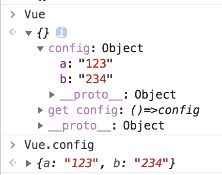

1.将构造函数作为参数传入定义函数当中,在定义函数当中改写构造函数的prototype



```js
// 从五个文件导入五个方法（不包括 warn）
import { initMixin } from './init'
import { stateMixin } from './state'
import { renderMixin } from './render'
import { eventsMixin } from './events'
import { lifecycleMixin } from './lifecycle'
import { warn } from '../util/index'

// 定义 Vue 构造函数
function Vue (options) {
  if (process.env.NODE_ENV !== 'production' &&
    !(this instanceof Vue)
  ) {
    warn('Vue is a constructor and should be called with the `new` keyword')
  }
  this._init(options)
}

// 将 Vue 作为参数传递给导入的五个方法
initMixin(Vue)
stateMixin(Vue)
eventsMixin(Vue)
lifecycleMixin(Vue)
renderMixin(Vue)

// 导出 Vue
export default Vue
```

最后输出处理过的构造函数`Vue`


2. 将属性修改为只读属性

   ```js
   // config
     const configDef = {}
     configDef.get = () => config
     if (process.env.NODE_ENV !== 'production') {
       configDef.set = () => {
         warn(
           'Do not replace the Vue.config object, set individual fields instead.'
         )
       }
     }
     Object.defineProperty(Vue, 'config', configDef)
   ```

   ```js
   let config = {a:'123',b:'234'}
   const configDef = {}
   configDef.get =()=>config
   let Vue ={}
   // 第三个参数为属性修饰符,就是改了vue.config的get
   Object.defineProperty(Vue,'config',configDef);
   ```

   

